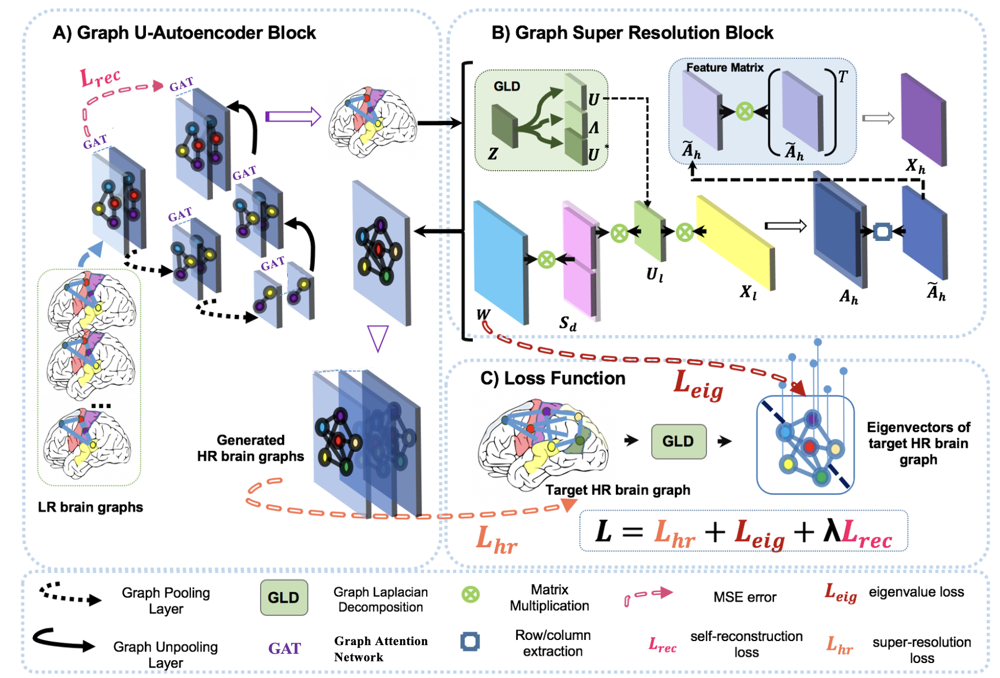
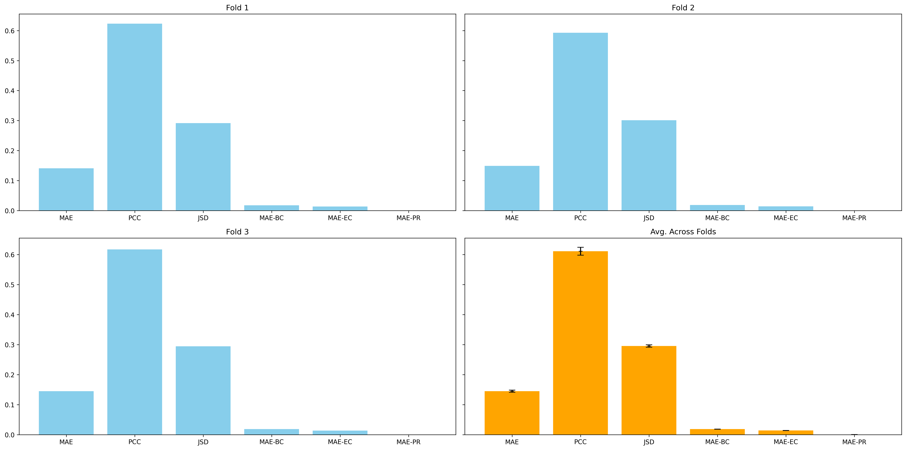

# DGL2024 Brain Graph Super-Resolution Challenge

## How to Run Instructions
```shell
python3 DGL_Project.py
```

## Contributors

- Team name: Adjacent Aces
- Team member: Reinis Barkans, Jiani Liu, Iqbal Karim, Wentao Ma, Olivia Ma

## Problem Description

- The problem is to produce a novel Generative Graph Neural Network that converts low resolution brain graph to high resolution brain graphs.
- The nature of the problem arises since it is relatively much easier to measure low resolution brain graphs compared to high resolution brain graphs. However, producing a way that extrapolates the corresponding high resolution brain graphs from their low-resolution  counterparts greatly saves resources given that it is within an expected, error range.

## NDAGSR-Net - Methodology

- Contributions
  - Attention based U-net block
  - Generator-Discriminator stabilization
- Attention based U-net block – use GAT layers 
  - 1 start GAT, 4 encoder blocks (GAT and gPool), 1 bottom GAT, 4 decoder blocks (GAT and gUnpool), 1 end GAT; skip connections used in decoder



## Used External Libraries

```shell
pip install -r requirements.txt
```

## Results



## References

- <a id="1">[1]</a> M. Isallari and I. Rekik. Gsr-net: Graph super-resolution network for predicting high-resolution from low-resolution functional brain connectomes. In Machine Learning in Medical Imaging: 11th International Workshop, MLMI 2020, Held in Conjunction with MICCAI 2020, Lima, Peru, October 4, 2020, Proceedings 11, pages 139–149. Springer, 2020.
- <a id="1">[2]</a> Megi Isallari and Islem Rekik. Brain graph super-resolution using adversarial graph neural network with application to functional brain connectivity. Medical Image Analysis, 71:102084, 2021
